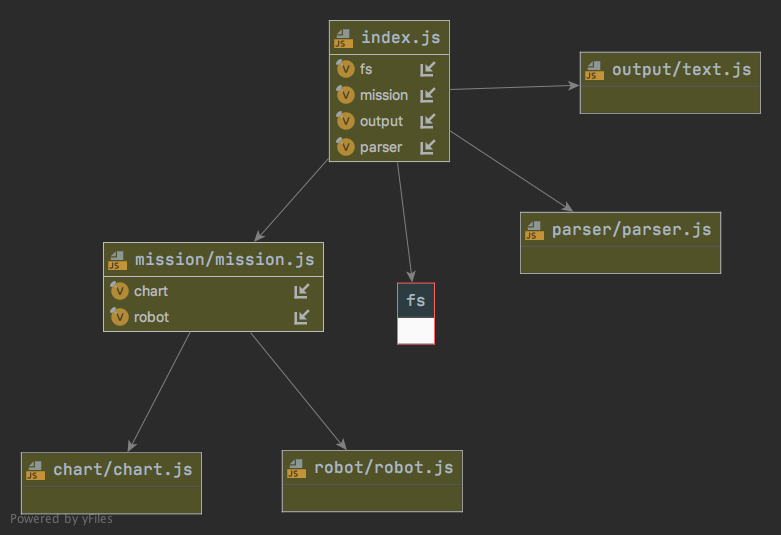
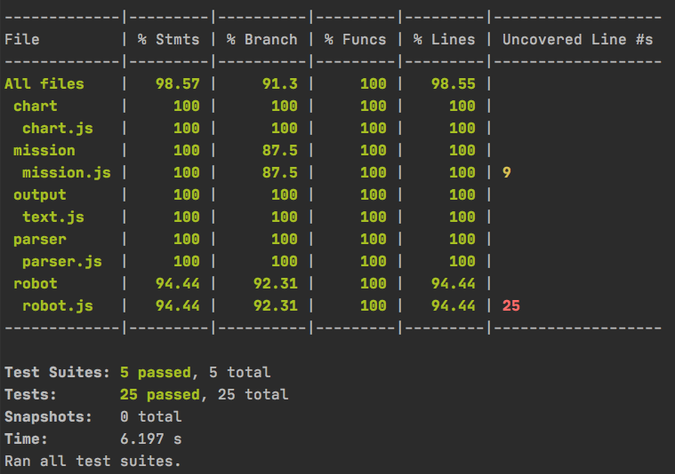

# Martian Robots Kata

The problem description is [here](problem.md)


## Solution

My initial approach is to divide the problem into 2 parts: analyze the data input to transform it into an object and execute a mission.
 - create a parser: analyze the data input to transform it.
 - create a mission with an object:
    - create a chart with information
    - create a robot
    - robot implements all instruction
    - return result of mission
 - print result to console

I write this code using Test Driven Development and Outside- in approach. At first I implement each part of the problem for a single robot and then I generalize the solution for more robots

## Technical Information

- Node version: v12.18.4
- Docker: 19.03
- Docker Compose: 1.26

## Project Diagram



## How to run
You can use Docker or Local environment

### Docker
For Docker, we have a Makefile

```
╰─$ make
help                           This help.
build                          Build the container
run                            run app
bash                           open bash
test                           run test
```

### Run
Run the application with the command:
- docker: `╰─$ make run`
- own environment: `╰─$ npm start`

result:

```shell script
> martian-robots-kata@1.0.0 start /app
> node ./index.js

1 1 E
3 3 N LOST
2 4 S LOST
```

To run your own file you can edit `input/input.txt`

### Test
To execute test 
- docker: `╰─$ make test`
- own environment: `╰─$ npm test`


```shell script
╰─$ make test

> martian-robots-kata@1.0.0 test /app
> jest

 PASS  src/robot/robot.test.js (8.731 s)
 PASS  src/parser/parser.test.js
 PASS  src/mission/mission.test.js
 PASS  src/output/text.test.js
 PASS  src/chart/chart.test.js

Test Suites: 5 passed, 5 total
Tests:       25 passed, 25 total
Snapshots:   0 total
Time:        26.132 s
Ran all test suites.
```

With code coverage:



